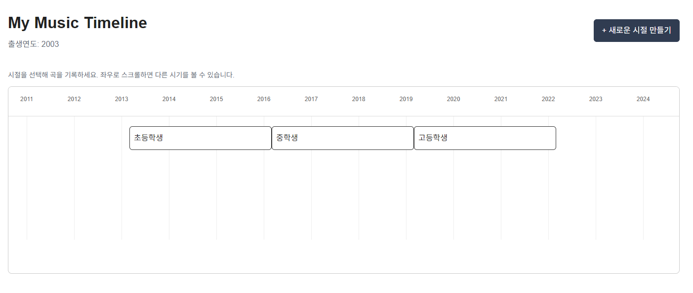
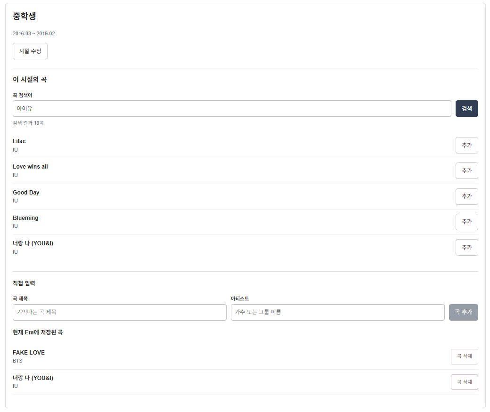
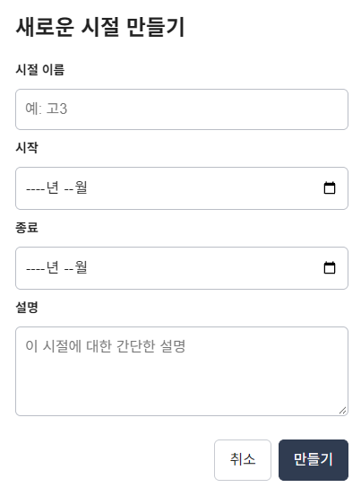

# Music Archive

사용자의 삶의 시기(Era)와 그 시절의 음악을 함께 기록하는 웹 애플리케이션입니다.

**[Live Demo](https://music-archive-cyan.vercel.app/)**



## 프로젝트 배경

과거에 즐겨 듣던 음악도 기록이 없으면 언제, 어떤 시절에 들었는지 떠올리기 어렵습니다. Music Archive는 음악을 삶의 시기와 연결해 기록하는 데서 시작했습니다. React와 TypeScript 기반으로 개발 중인 개인 포트폴리오 프로젝트입니다.

## 현재 구현 기능 · v0.1

- **온보딩:** 출생연도 입력 및 초·중·고 학교 Era 자동 생성. 아직 시작하지 않은 학교 시기는 생성하지 않습니다.
- **Timeline:** 월 단위 시간축에서 Era 확인·선택, 겹치는 시기는 별도 줄에 표시합니다.
- **Era 관리:** 사용자 Era 생성·수정, 이름·기간·설명 상세 확인.
- **음악 검색:** iTunes Search API를 이용해 곡·아티스트를 검색하고,
  검색 결과에서 선택한 곡을 현재 Era에 추가할 수 있습니다.
- **곡 관리:** 선택한 Era에 곡 제목·아티스트를 직접 입력해 추가하고, Era별 목록 확인 및 곡 삭제. 빈 값이나 공백만 있는 입력은 추가하지 않습니다.
- **저장·복원:** 프로필·Era·곡 및 관계 데이터를 localStorage에 저장하고 새로고침 후 복원합니다.

## 사용 흐름

앱 접속 → 출생연도 온보딩 → Timeline 확인 → Era 생성/선택 → 곡 검색 또는 직접 입력 → 곡 추가 → 새로고침 후 데이터 유지

저장된 프로필이 있으면 온보딩을 건너뛰고 Timeline으로 시작합니다. 새로고침 후에는 Era를 다시 선택해 곡 목록을 확인할 수 있습니다.

## 기술 스택

| 기술 | 용도 |
| --- | --- |
| React | 컴포넌트와 화면 상태 관리 |
| TypeScript | 데이터 및 컴포넌트 props 타입 정의 |
| Vite | 개발 서버와 빌드 |
| CSS | 화면 스타일과 Timeline 배치 |
| localStorage | 브라우저 내 데이터 저장·복원 |
| iTunes Search API | 외부 음악 검색 및 JSON 응답 처리 |

## 실행 방법

Node.js와 npm이 설치된 환경에서 저장소를 내려받고, 프로젝트 루트에서 실행합니다.

```bash
npm install
npm run dev
```

터미널에 표시되는 개발 서버 주소를 브라우저에서 엽니다.

추가 확인 명령:

```bash
npm run lint    # 코드 규칙 검사
npm run build   # TypeScript 검사 및 배포용 빌드
npm run preview # 빌드 후 로컬 미리보기
```

## 현재 버전의 범위

v0.1은 **Era를 만들고 곡을 기록한 뒤 다시 확인하는 핵심 사용자 흐름**을 동작시키는 최소 구현 버전입니다. 
곡은 직접 입력하거나 iTunes Search API를 통해 검색해 추가할 수 있습니다.
추천, 재생, 로그인 및 서버/DB는 아직 구현하지 않았습니다.

데이터는 같은 브라우저의 같은 사이트 주소에 저장됩니다. 다른 기기와 동기화되지 않으며 브라우저의 사이트 데이터를 삭제하면 기록도 사라집니다. 선택된 Era·모달·입력 중인 값은 저장하지 않습니다.

## 주요 프로젝트 구조

| 경로 | 역할 |
| --- | --- |
| `src/App.tsx` | 공유 상태, 데이터 갱신과 화면 연결 |
| `src/components/` | Onboarding, Timeline, EraDetail, EraModal, EraTracks 화면 구성 |
| `src/types/` | Era, Track, EraTrack, 음악 검색 결과 타입 |
| `src/utils/` | 날짜 계산, 학교 Era 생성·배치, localStorage 저장·복원 |
| `src/services/` | 외부 음악 검색 API 요청 및 응답 변환 |
| `src/styles/`, `src/index.css` | 화면별 스타일과 공통 스타일 |
| `docs/` | 제품 방향, 구현 현황과 결정 기록 |

상세 내용은 [제품 사양](docs/PRODUCT_SPEC.md), [로드맵](docs/ROADMAP.md), [결정 기록](docs/DECISIONS.md)에서 확인할 수 있습니다.

## 향후 계획 · 미구현

- Seed(기억나는 대표곡) 기반 음악 추천 및 사용자 확인을 통한 과거 음악 기록 복원
- 현재 Era Timeline을 바탕으로 Life Timeline 경험 확장
- 곡은 기억나지만 시기가 불확실한 경우를 위한 Unassigned 등 확장 기능
- Spotify·Apple Music 등 음악 서비스 연동 확장

## Live Demo

👉 [Music Archive v0.1](https://music-archive-cyan.vercel.app/)

## Screenshots

### Timeline
삶의 시기를 Era 단위로 확인하고 원하는 Era를 선택할 수 있습니다.


### 음악 검색 및 Era별 음악 기록

iTunes Search API로 곡과 아티스트를 검색하고, 원하는 곡을 선택해 현재 Era에 기록할 수 있습니다.
검색되지 않는 곡은 직접 입력할 수도 있습니다.



### Era 생성
사용자가 직접 이름, 기간, 설명을 입력해 새로운 Era를 만들 수 있습니다.


